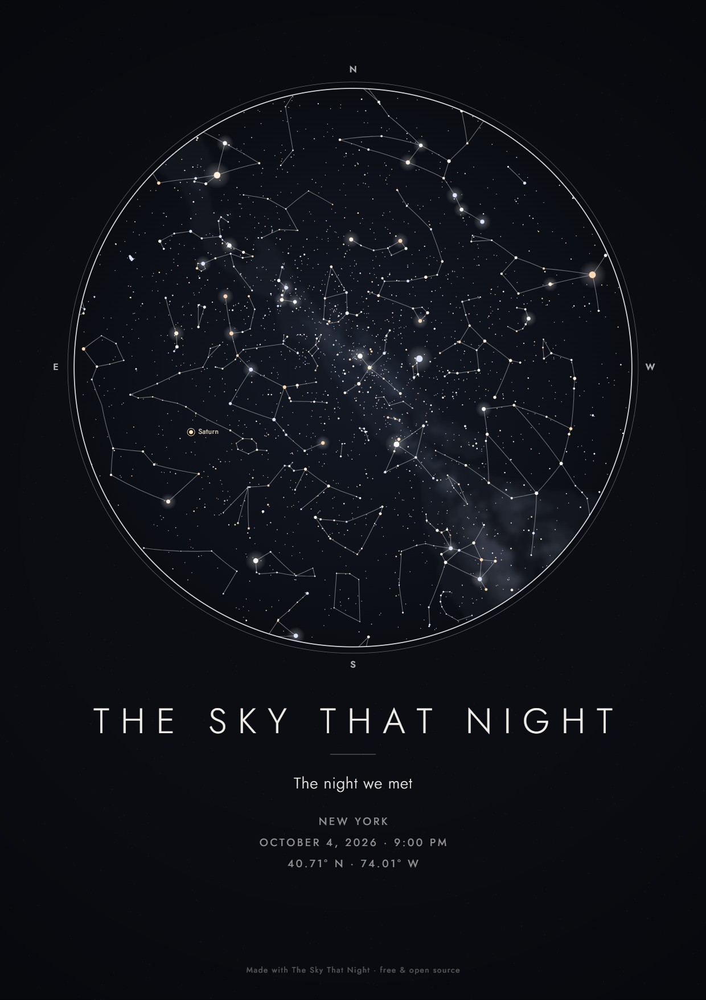
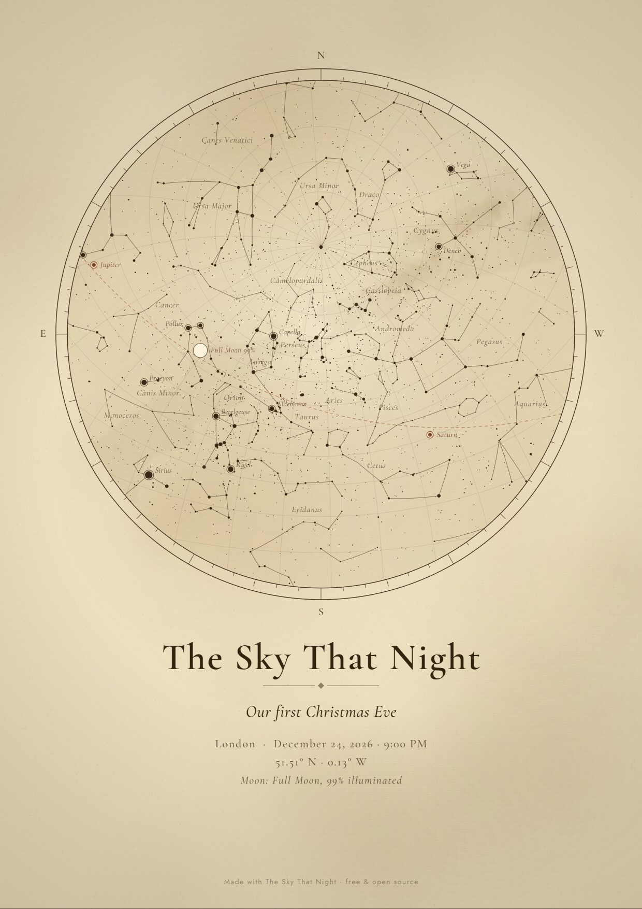
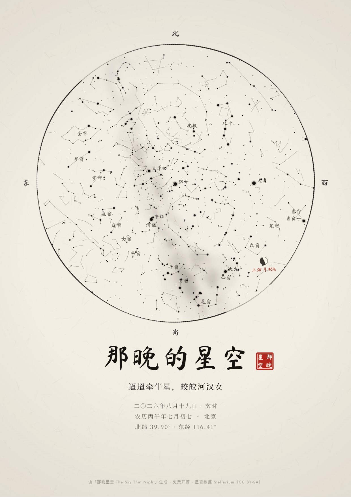

# The Sky That Night

**Pick a date and a place. Get a print-ready poster of the real night sky at that moment.**
Free, open source, and nothing ever leaves your browser.

**Try it: https://goldfish76.github.io/the-sky-that-night/**

[中文说明](README.zh-CN.md)


## Features

- **The real sky, not a pretty guess.** Stars, Moon and planets are computed for your exact date, time and place.
- **Three styles:**
  - *Noir*: minimal black.
  - *Parchment*: an old star atlas, with a coordinate grid and the ecliptic.
  - *Ink Wash*: Chinese 水墨 painting with a red seal.
- **Two sky cultures.** Western constellations, or traditional Chinese asterisms (the 28 lunar mansions, 北斗, 织女, 牛郎…).
- **Moon with the right phase and orientation, plus the five naked-eye planets and the Milky Way.**
- **Real local time.** Your browser's time-zone database applies historical daylight-saving rules.
- **Bilingual (English / 中文).** The Ink style can show the Chinese lunar date and the traditional double-hour (时辰).
- **Print-ready PNG.** A4 or A3 at 300 DPI.
- **Private by design.** No account, no tracking, no uploads.

| Noir | Parchment | Ink Wash |
|---|---|---|
|  |  |  |

## Run it locally

It is a static site with no build step:

```bash
git clone https://github.com/Goldfish76/the-sky-that-night
cd the-sky-that-night
python -m http.server 8000
```

Then open http://localhost:8000. Any static file server works.

## How accurate is it?

1. **Star positions:** the Hipparcos-derived catalog bundled with [d3-celestial](https://github.com/ofrohn/d3-celestial), in J2000 coordinates.
2. **Orientation:** [Astronomy Engine](https://github.com/cosinekitty/astronomy) converts the zenith and the north point of the horizon into the same J2000 frame. That fixes the map's centre and its rotation for your moment.
3. **Projection:** zenith-centred stereographic, the way you see the sky lying on your back. The horizon is the circle, north is up and east is on the left.
4. **Moon and planets:** topocentric positions, with the Moon's phase and the direction of its lit side.
5. **Check:** compared against Astronomy Engine's own altitude/azimuth for bright stars, the largest error is about **0.005°**.
6. **Not modelled:** atmospheric refraction. Near the horizon, real stars appear up to ~0.5° higher.

## Roadmap

- [ ] "Light-year birthday star": a star whose light left it the year you were born
- [ ] Two skies side by side (where you each were born)
- [ ] Vector PDF / SVG export
- [ ] Search any place, offline
- [ ] Self-hosted fonts, so it also works where Google Fonts is blocked
- [ ] More styles. Themes live in [`js/themes.js`](js/themes.js); pull requests welcome.

## Credits and license

The code is under the [MIT License](LICENSE). Data and libraries keep their own licenses, listed in [ATTRIBUTION.md](ATTRIBUTION.md). Note that the Chinese asterism data is **CC BY-SA**. Posters drawn with it carry that attribution in the credit line.
