# The Sky That Night

**Pick a date and a place. Get a print-ready poster of the real night sky at that moment.**
Free, open source, and nothing ever leaves your browser.

**Try it: https://goldfish76.github.io/the-sky-that-night/**

[中文说明](README.zh-CN.md)


## Features

- **The real sky, not a pretty guess.** Stars, Moon and planets are computed for your exact date, time and place.
- **17 styles**, from minimal to handmade (see them all [below](#styles)).
- **Two sky cultures.** Western constellations, or traditional Chinese asterisms (the 28 lunar mansions, 北斗, 织女, 牛郎…).
- **Moon with the right phase and orientation, plus the five naked-eye planets and the Milky Way.**
- **Real local time.** Your browser's time-zone database applies historical daylight-saving rules.
- **Light-year birthday star.** Enter a birthday and the poster marks a naked-eye star whose distance in light-years matches the age that night. The light you saw from it left the star the year you were born.
- **Two skies on one poster.** For example, the nights two people were born, each with its own date and place.
- **Any place on Earth.** Offline search over 34,000 cities with their time zones, or enter custom coordinates.
- **Print-ready PNG, PDF or SVG.** A4 or A3 at 300 DPI. The SVG is fully vector (with its fonts embedded), so you can edit it or send it to a laser engraver.
- **Phone wallpaper.** A 1290 × 2796 version that keeps the top clear for the lock-screen clock.

## Styles

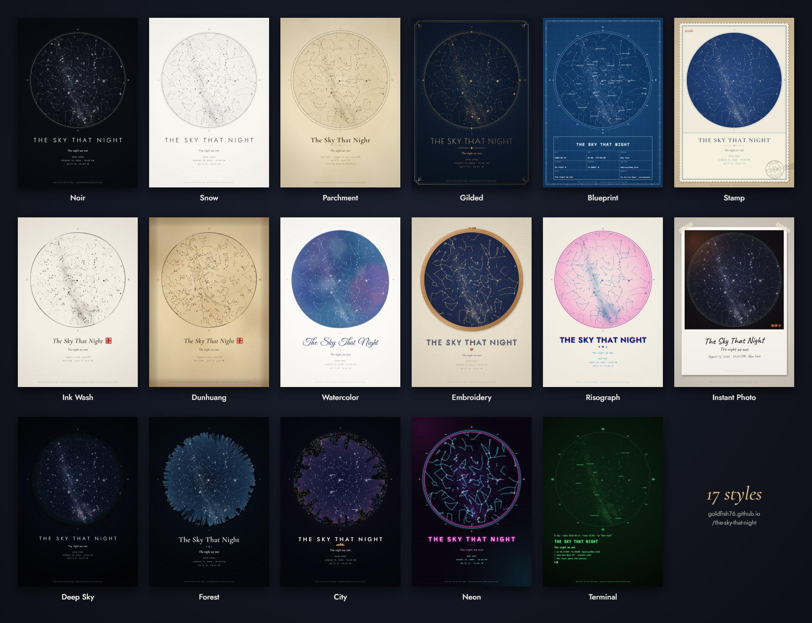

- **Minimal:** *Noir* and *Snow*.
- **Vintage:** *Parchment* (an old star atlas), *Gilded* (Art Deco in gold), *Blueprint* (an engineering drawing with a title block), *Stamp* (a perforated stamp whose postmark carries your date and place).
- **Chinese:** *Ink Wash* (水墨 with a red seal), *Dunhuang* (after the Tang-dynasty Dunhuang star chart: stars in three pigments, the 28 lunar mansions, the Milky Way as a band, and the text in vertical columns).
- **Handmade:** *Watercolor* (every poster gets its own wash), *Embroidery* (a hoop, back-stitched constellations and a cross-stitched title), *Risograph* (two inks, halftone dots, loose registration), *Instant Photo* (a taped instant photo with a handwritten caption).
- **Photographic:** *Deep Sky* (an astrophoto), *Forest* (lying in a clearing, the treeline framing the sky), *City* (looking straight up between towers, where only the brighter stars get through).
- **Screens:** *Neon* and *Terminal* (the poster as a shell session).

The treeline and the skyline are drawn from the place's coordinates, so every place gets its own, and anything behind them is hidden as it would be in a real all-sky photo.

Click a poster to open it in the app.

| [Forest · Yosemite](https://goldfish76.github.io/the-sky-that-night/#v=1&lang=en&th=forest&cu=w&o=lmbc&d=2026-08-12&t=23%3A30&lat=37.745&lon=-119.593&tz=America%2FLos_Angeles&pn=Yosemite+Valley&msg=Under+the+Perseids) | [Stamp · Lisbon](https://goldfish76.github.io/the-sky-that-night/#v=1&lang=en&th=stamp&cu=w&o=lmbc&d=2026-07-18&t=22%3A30&lat=38.722&lon=-9.139&tz=Europe%2FLisbon&pn=Lisbon&pz=%E9%87%8C%E6%96%AF%E6%9C%AC&msg=Wish+you+were+here) | [Embroidery · 杭州](https://goldfish76.github.io/the-sky-that-night/#v=1&lang=zh&th=embroidery&cu=w&o=lmbc&d=2026-05-20&t=21%3A00&lat=30.274&lon=120.155&tz=Asia%2FShanghai&pn=Hangzhou&pz=%E6%9D%AD%E5%B7%9E&msg=%E4%BA%94%E6%9C%88%E4%BA%8C%E5%8D%81%E6%97%A5%EF%BC%8C%E8%A5%BF%E6%B9%96%E8%BE%B9) |
|---|---|---|
| [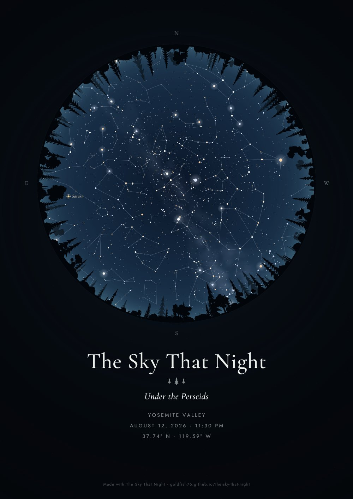](https://goldfish76.github.io/the-sky-that-night/#v=1&lang=en&th=forest&cu=w&o=lmbc&d=2026-08-12&t=23%3A30&lat=37.745&lon=-119.593&tz=America%2FLos_Angeles&pn=Yosemite+Valley&msg=Under+the+Perseids) | [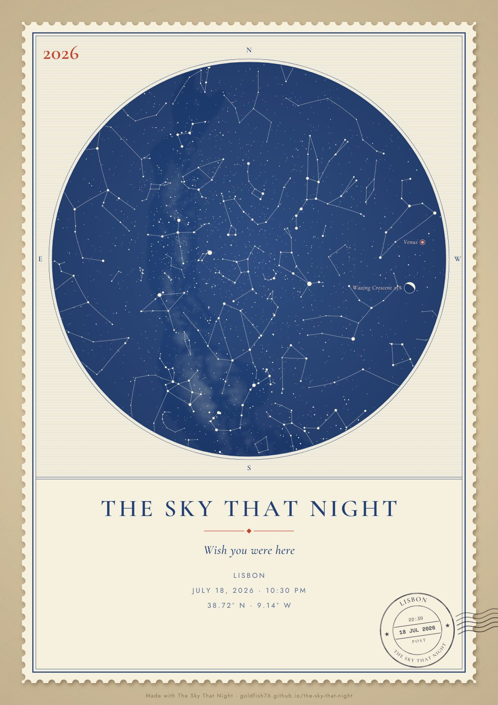](https://goldfish76.github.io/the-sky-that-night/#v=1&lang=en&th=stamp&cu=w&o=lmbc&d=2026-07-18&t=22%3A30&lat=38.722&lon=-9.139&tz=Europe%2FLisbon&pn=Lisbon&pz=%E9%87%8C%E6%96%AF%E6%9C%AC&msg=Wish+you+were+here) | [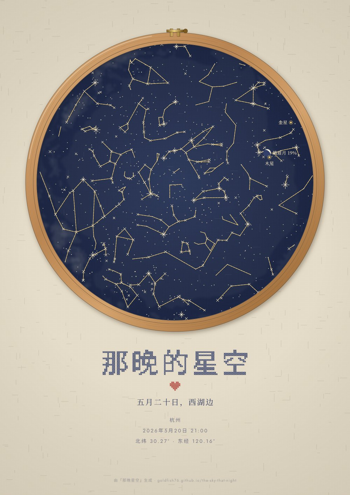](https://goldfish76.github.io/the-sky-that-night/#v=1&lang=zh&th=embroidery&cu=w&o=lmbc&d=2026-05-20&t=21%3A00&lat=30.274&lon=120.155&tz=Asia%2FShanghai&pn=Hangzhou&pz=%E6%9D%AD%E5%B7%9E&msg=%E4%BA%94%E6%9C%88%E4%BA%8C%E5%8D%81%E6%97%A5%EF%BC%8C%E8%A5%BF%E6%B9%96%E8%BE%B9) |

| [Dunhuang · 敦煌, Mid-Autumn](https://goldfish76.github.io/the-sky-that-night/#v=1&lang=zh&th=dunhuang&cu=cn&o=lnmbc&d=2026-09-25&t=21%3A00&lat=40.142&lon=94.662&tz=Asia%2FShanghai&pn=Dunhuang&pz=%E6%95%A6%E7%85%8C&msg=%E6%B5%B7%E4%B8%8A%E7%94%9F%E6%98%8E%E6%9C%88%EF%BC%8C%E5%A4%A9%E6%B6%AF%E5%85%B1%E6%AD%A4%E6%97%B6) | [City · New Year's Eve](https://goldfish76.github.io/the-sky-that-night/#v=1&lang=en&th=city&cu=w&o=lbsc&ti=The+Last+Night+of+2026&msg=One+minute+to+midnight&d=2026-12-31&t=23%3A59&lat=40.758&lon=-73.986&tz=America%2FNew_York&pn=New+York&pz=%E7%BA%BD%E7%BA%A6&pl=Times+Square) | [Instant Photo · Paris](https://goldfish76.github.io/the-sky-that-night/#v=1&lang=en&th=instant&cu=w&o=lmbc&d=2026-06-14&t=23%3A30&lat=48.857&lon=2.352&tz=Europe%2FParis&pn=Paris&pz=%E5%B7%B4%E9%BB%8E&msg=Our+first+night+in+Paris) |
|---|---|---|
| [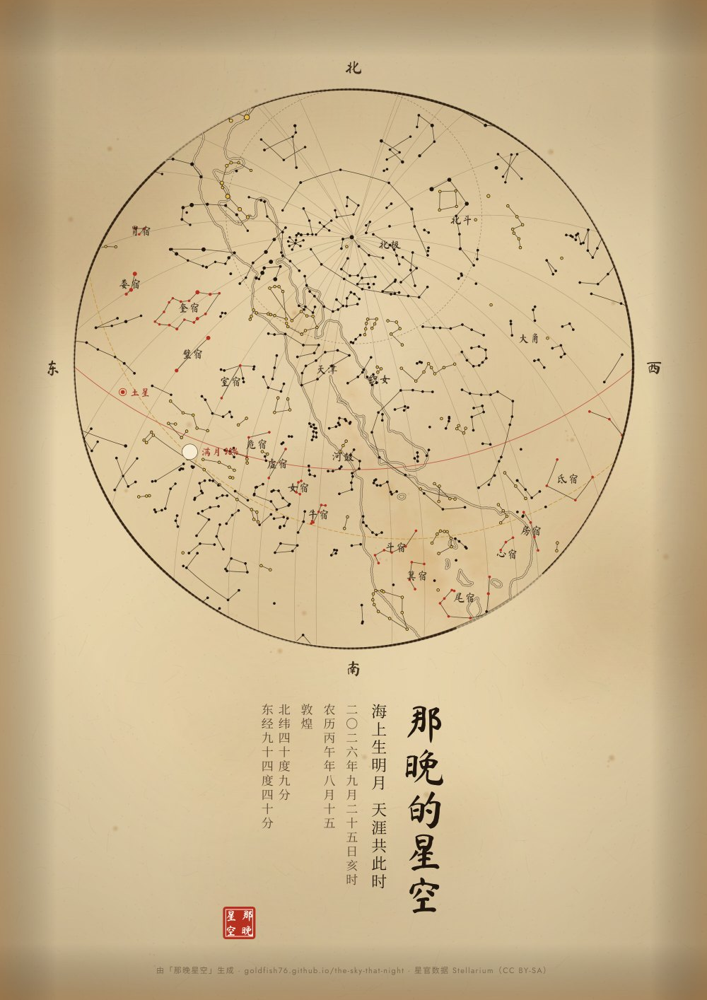](https://goldfish76.github.io/the-sky-that-night/#v=1&lang=zh&th=dunhuang&cu=cn&o=lnmbc&d=2026-09-25&t=21%3A00&lat=40.142&lon=94.662&tz=Asia%2FShanghai&pn=Dunhuang&pz=%E6%95%A6%E7%85%8C&msg=%E6%B5%B7%E4%B8%8A%E7%94%9F%E6%98%8E%E6%9C%88%EF%BC%8C%E5%A4%A9%E6%B6%AF%E5%85%B1%E6%AD%A4%E6%97%B6) | [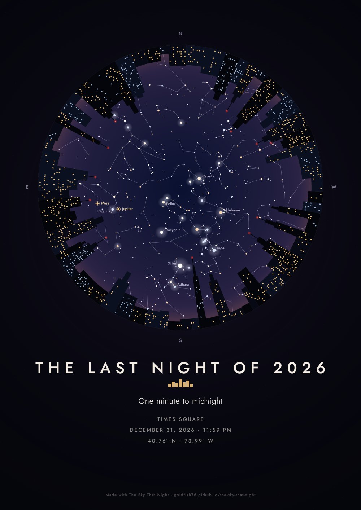](https://goldfish76.github.io/the-sky-that-night/#v=1&lang=en&th=city&cu=w&o=lbsc&ti=The+Last+Night+of+2026&msg=One+minute+to+midnight&d=2026-12-31&t=23%3A59&lat=40.758&lon=-73.986&tz=America%2FNew_York&pn=New+York&pz=%E7%BA%BD%E7%BA%A6&pl=Times+Square) | [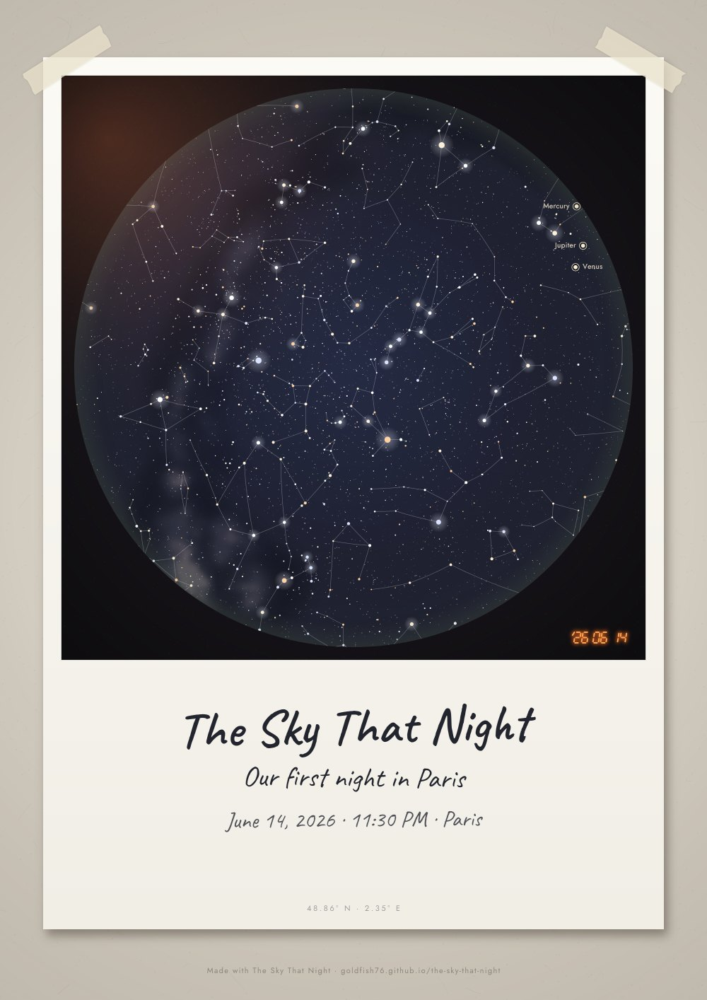](https://goldfish76.github.io/the-sky-that-night/#v=1&lang=en&th=instant&cu=w&o=lmbc&d=2026-06-14&t=23%3A30&lat=48.857&lon=2.352&tz=Europe%2FParis&pn=Paris&pz=%E5%B7%B4%E9%BB%8E&msg=Our+first+night+in+Paris) |

| Light-year birthday star | Two skies | 两片星空 |
|---|---|---|
| 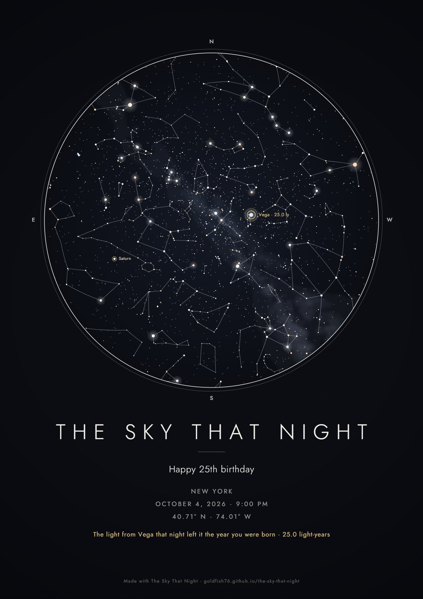 | 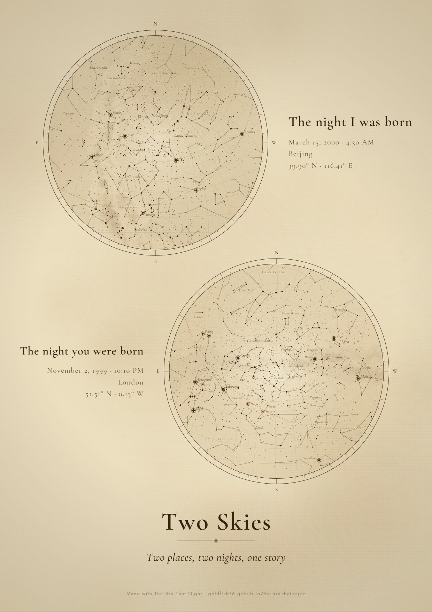 | 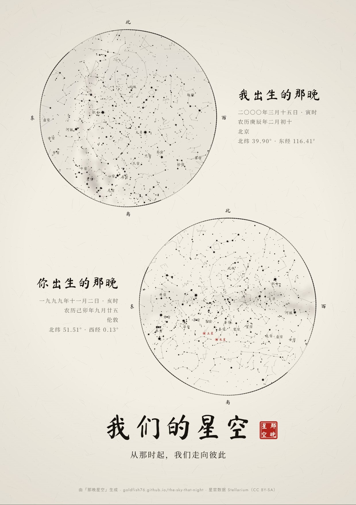 |

## Famous nights to try

Each link opens the app with that moment already set.

| [One Small Step](https://goldfish76.github.io/the-sky-that-night/#v=1&lang=en&th=noir&cu=w&o=lmbsc&d=1969-07-20&t=21%3A56&lat=29.76&lon=-95.37&tz=America%2FChicago&pn=Houston&pz=%E4%BC%91%E6%96%AF%E6%95%A6&ti=One+Small+Step&msg=The+Moon%2C+23%C2%B0+above+Houston%2C+as+Armstrong+stepped+onto+it) | [Saint-Rémy, 1889](https://goldfish76.github.io/the-sky-that-night/#v=1&lang=en&th=parchment&cu=w&o=lnmbgsc&d=1889-06-19&t=03%3A00&lat=43.789&lon=4.832&tz=Europe%2FParis&pn=Saint-R%C3%A9my-de-Provence&ti=Saint-R%C3%A9my%2C+1889&msg=Before+dawn%2C+the+month+Van+Gogh+painted+The+Starry+Night) | [七夕 · 北京](https://goldfish76.github.io/the-sky-that-night/#v=1&lang=zh&th=ink&cu=cn&o=lnmbsc&d=2026-08-19&t=21%3A00&lat=39.904&lon=116.407&tz=Asia%2FShanghai&pn=Beijing&pz=%E5%8C%97%E4%BA%AC&ti=%E9%82%A3%E6%99%9A%E7%9A%84%E6%98%9F%E7%A9%BA&msg=%E8%BF%A2%E8%BF%A2%E7%89%B5%E7%89%9B%E6%98%9F%EF%BC%8C%E7%9A%8E%E7%9A%8E%E6%B2%B3%E6%B1%89%E5%A5%B3) |
|---|---|---|
| 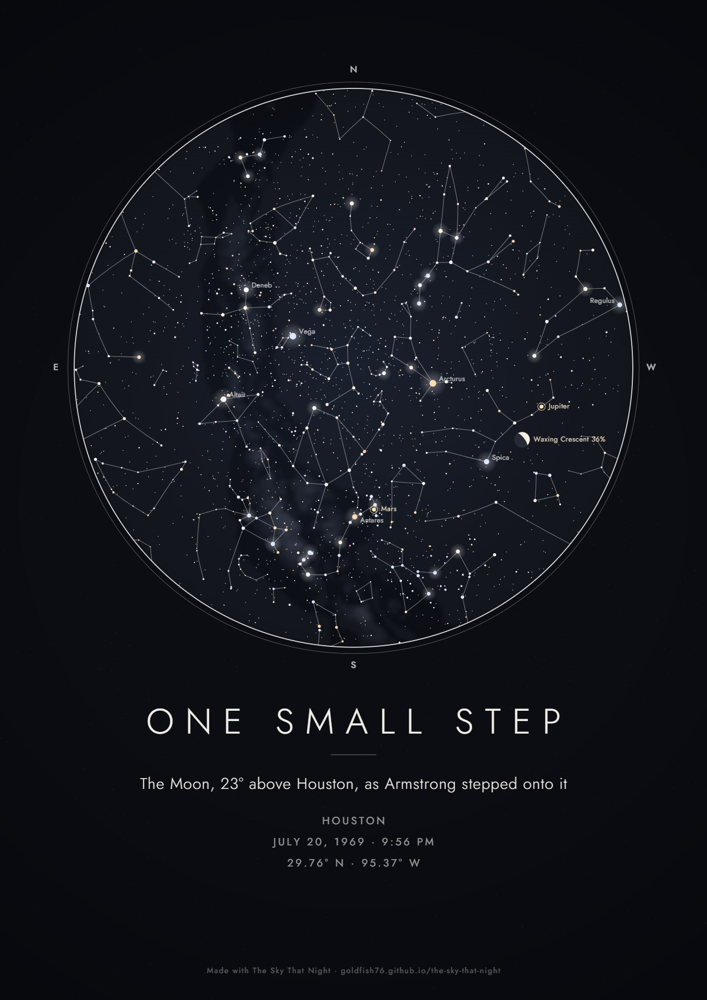 | 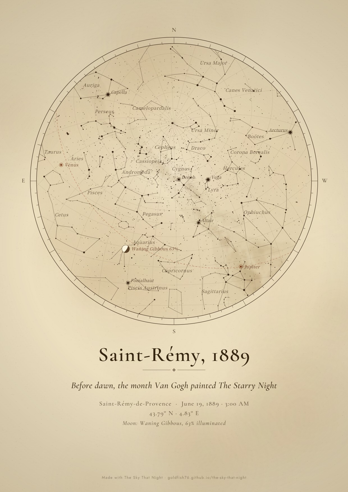 |  |
| Houston at 9:56 PM on July 20, 1969, the moment Armstrong stepped onto the Moon. The Moon is 23° above the western horizon. | Before dawn in Saint-Rémy, the month Van Gogh painted *The Starry Night*. Venus, the bright "morning star" of the painting, is rising in the east. | Qixi (Chinese Valentine's Day) 2026 in Beijing: the Weaver Girl (Vega) and the Cowherd (Altair) on either side of the Milky Way. |

## Run it locally

It is a static site with no build step:

```bash
git clone https://github.com/Goldfish76/the-sky-that-night
cd the-sky-that-night
python -m http.server 8000
```

Then open http://localhost:8000. Any static file server works.

## How accurate is it?

1. **Star positions:** the Hipparcos-derived catalog bundled with [d3-celestial](https://github.com/ofrohn/d3-celestial), in J2000 coordinates.
2. **Orientation:** [Astronomy Engine](https://github.com/cosinekitty/astronomy) converts the zenith and the north point of the horizon into the same J2000 frame. That fixes the map's centre and its rotation for your moment.
3. **Projection:** zenith-centred stereographic, the way you see the sky lying on your back. The horizon is the circle, north is up and east is on the left.
4. **Moon and planets:** topocentric positions, with the Moon's phase and the direction of its lit side.
5. **Check:** compared against Astronomy Engine's own altitude/azimuth for bright stars, the largest error is about **0.005°**.
6. **Not modelled:** atmospheric refraction. Near the horizon, real stars appear up to ~0.5° higher.
7. **Birthday-star distances:** from the [HYG database](https://github.com/astronexus/HYG-Database) (Hipparcos parallaxes). For the fainter stars the uncertainty can be a few light-years.

## Make your own style

A style is one object in [`js/themes.js`](js/themes.js): colours, fonts, and effects picked by name (paper textures, star shapes, frames, text layouts). The effects live in [`js/decor.js`](js/decor.js), [`js/layouts.js`](js/layouts.js) and [`js/horizon.js`](js/horizon.js). Copy a theme, change it, add its id to `THEME_ORDER`, and run `python -m http.server`. Pull requests with new styles are welcome.

## Rebuilding the data

`python tools/build_data.py` downloads the public sources and regenerates the files in `data/` (star names, birthday-star distances, world cities, the 28 lunar mansions).
`python tools/build_fonts.py` rebuilds the self-hosted fonts in `fonts/` (needs `pip install fonttools brotli`).

## Credits and license

The code is under the [MIT License](LICENSE). Data, libraries and fonts keep their own licenses, listed in [ATTRIBUTION.md](ATTRIBUTION.md). Note that the Chinese asterism data is **CC BY-SA**. Posters drawn with it carry that attribution in the credit line.
