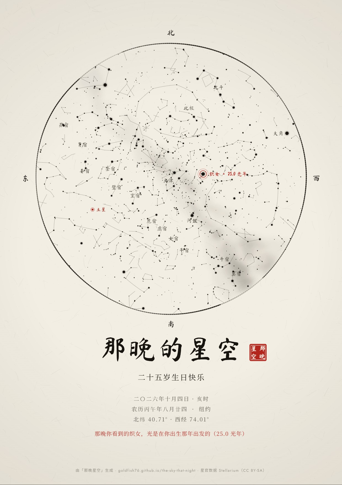
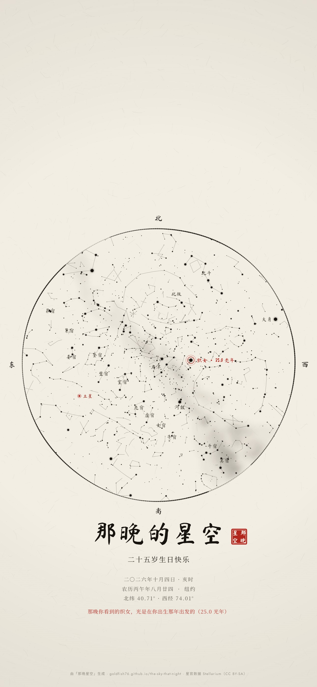

# 那晚星空 · The Sky That Night

**输入日期和地点，生成那一刻头顶真实星空的海报，可直接打印。**
免费、开源，所有计算都在你的浏览器里完成，日期和地点不会被上传。

**在线使用：https://goldfish76.github.io/the-sky-that-night/**

[English](README.md)


## 特点

- **真实的天空，不是随手画的装饰图。** 星星、月亮和行星都按你给的日期、时刻和地点精确计算。
- **三种风格**
  - 极简黑
  - 复古羊皮纸：老星图风格，带坐标网格和黄道
  - 水墨：宣纸质感，配朱红印章
- **两种星座体系：** 西方 88 星座，或中国传统星官（二十八宿、北斗、织女、牛郎……）。
- **天体：** 月亮的月相和亮面朝向都是对的；也会画出五颗肉眼可见的行星和银河。
- **真实的当地时间：** 浏览器自带的时区数据库会处理历史上的夏令时（包括中国 1986–1991 年实行过的夏令时）。
- **中英双语：** 水墨风格还会写出农历日期和时辰，例如"农历丙午年七月初七 · 亥时"。
- **光年生日星：** 填上生日，海报会标出一颗肉眼可见的星，它离地球的距离（以光年计）约等于你那晚的年龄。那晚你看到的它的光，正是在你出生那年出发的。
- **两片星空：** 一张海报上放两片星空，比如两个人各自出生的那晚，日期和地点各不相同。
- **全球任意地点：** 离线搜索 3.4 万个城市，自动带出时区；也可以手动输入经纬度。
- **打印级导出：** PNG、PDF 或 SVG，A4 / A3，300 DPI。SVG 是全矢量的（内嵌字体），可以二次编辑，也可以直接用于激光雕刻。
- **手机壁纸：** 1290 × 2796 竖版，顶部留出锁屏时钟的位置。
- **分享链接：** 所有设置都存在链接里，发给别人就能打开同一张海报，也可以收藏起来下次接着改。
- **隐私：** 不用注册，不做追踪，不上传任何数据，也不向任何第三方发请求。字体放在本站，城市搜索在本地完成。

| 极简黑 | 复古羊皮纸 | 水墨 |
|---|---|---|
|  |  |  |

> 示例图里的水墨版是 2026 年七夕（8 月 19 日）晚上九点的北京：织女星和牛郎星分列银河两岸，月亮正好是上弦月。

| 光年生日星 | 两片星空（羊皮纸） | 两片星空（水墨） |
|---|---|---|
|  |  |  |

## 试试这些"名场面"之夜

点链接会直接打开设置好的星空。

| [七夕 · 北京](https://goldfish76.github.io/the-sky-that-night/#v=1&lang=zh&th=ink&cu=cn&o=lnmbsc&d=2026-08-19&t=21%3A00&lat=39.904&lon=116.407&tz=Asia%2FShanghai&pn=Beijing&pz=%E5%8C%97%E4%BA%AC&ti=%E9%82%A3%E6%99%9A%E7%9A%84%E6%98%9F%E7%A9%BA&msg=%E8%BF%A2%E8%BF%A2%E7%89%B5%E7%89%9B%E6%98%9F%EF%BC%8C%E7%9A%8E%E7%9A%8E%E6%B2%B3%E6%B1%89%E5%A5%B3) | [登月那一刻](https://goldfish76.github.io/the-sky-that-night/#v=1&lang=en&th=noir&cu=w&o=lmbsc&d=1969-07-20&t=21%3A56&lat=29.76&lon=-95.37&tz=America%2FChicago&pn=Houston&pz=%E4%BC%91%E6%96%AF%E6%95%A6&ti=One+Small+Step&msg=The+Moon%2C+23%C2%B0+above+Houston%2C+as+Armstrong+stepped+onto+it) | [圣雷米，1889](https://goldfish76.github.io/the-sky-that-night/#v=1&lang=en&th=parchment&cu=w&o=lnmbgsc&d=1889-06-19&t=03%3A00&lat=43.789&lon=4.832&tz=Europe%2FParis&pn=Saint-R%C3%A9my-de-Provence&ti=Saint-R%C3%A9my%2C+1889&msg=Before+dawn%2C+the+month+Van+Gogh+painted+The+Starry+Night) |
|---|---|---|
|  |  |  |
| 2026 年七夕晚上九点的北京：织女星和牛郎星分列银河两岸，月亮正好是上弦月。 | 1969 年 7 月 20 日晚 9:56 的休斯敦，阿姆斯特朗踏上月球的那一刻：月亮就挂在西边 23° 的高度。 | 梵高画《星月夜》的那个月，圣雷米黎明前的天空：画里那颗明亮的"启明星"金星，正从东方升起。 |



## 本地运行

纯静态网页，不需要构建：

```bash
git clone https://github.com/Goldfish76/the-sky-that-night
cd the-sky-that-night
python -m http.server 8000
```

然后在浏览器打开 http://localhost:8000 即可。

## 有多准？

1. **星表：** 用 [d3-celestial](https://github.com/ofrohn/d3-celestial) 提供的星表，来自依巴谷（Hipparcos）星表，J2000 坐标。
2. **天顶和方位：** 用 [Astronomy Engine](https://github.com/cosinekitty/astronomy) 把你所在位置的天顶和地平线正北点换算到同一坐标系，确定星图的中心和旋转角度。
3. **投影方式：** 以天顶为中心的球极投影，相当于你躺在地上看天。圆周就是地平线，上北下南，左东右西。
4. **月亮和行星：** 按观测者所在位置计算，月相和亮面朝向都准确。
5. **校验结果：** 和独立的天文计算对比亮星的高度角与方位角，最大误差约 **0.005°**。
6. **尚未模拟大气折射：** 真实天空中，地平线附近的星星看起来会高约 0.5°。
7. **光年生日星的距离：** 来自 [HYG 数据库](https://github.com/astronexus/HYG-Database)（依巴谷视差）。较暗的星，距离误差可能有几光年。

## 计划

- [x] 光年生日星
- [x] 两片星空
- [x] PDF 导出（300 DPI）
- [x] 离线搜索全球城市
- [x] 矢量 SVG 导出、手机壁纸、分享链接
- [x] 字体自托管：不依赖 Google Fonts，在国内也能正常显示
- [ ] 两片星空版式也支持光年生日星
- [ ] 更多风格：主题都在 [`js/themes.js`](js/themes.js)，欢迎提 PR

## 重新生成数据

运行 `python tools/build_data.py`，会下载公开数据源，重新生成 `data/` 里的星名、生日星距离和全球城市文件。
运行 `python tools/build_fonts.py`（需要先 `pip install fonttools brotli`），会重新生成 `fonts/` 里的自托管字体。

## 致谢与许可

代码采用 [MIT 许可证](LICENSE)。数据和第三方库各有许可，见 [ATTRIBUTION.md](ATTRIBUTION.md)。

其中中国星官数据来自 Stellarium，采用 **CC BY-SA** 许可。使用中国星官的海报会在底部署名中自动注明出处。
